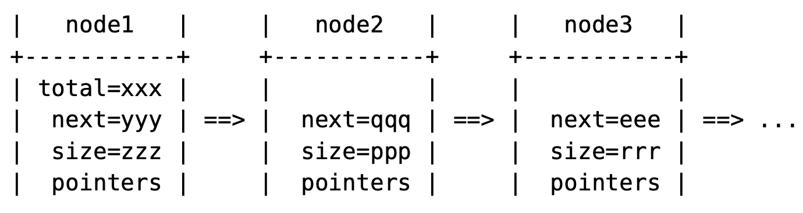
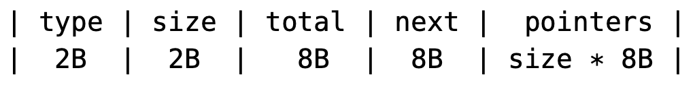
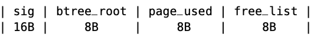

<!-- START doctoc generated TOC please keep comment here to allow auto update -->
<!-- DON'T EDIT THIS SECTION, INSTEAD RE-RUN doctoc TO UPDATE -->


- [07.空闲列表：重用页面](#07%E7%A9%BA%E9%97%B2%E5%88%97%E8%A1%A8%E9%87%8D%E7%94%A8%E9%A1%B5%E9%9D%A2)
  - [7.1 设计空闲列表](#71-%E8%AE%BE%E8%AE%A1%E7%A9%BA%E9%97%B2%E5%88%97%E8%A1%A8)
  - [7.2 空闲列表数据类型](#72-%E7%A9%BA%E9%97%B2%E5%88%97%E8%A1%A8%E6%95%B0%E6%8D%AE%E7%B1%BB%E5%9E%8B)
  - [7.3 空闲列表的实现](#73-%E7%A9%BA%E9%97%B2%E5%88%97%E8%A1%A8%E7%9A%84%E5%AE%9E%E7%8E%B0)
  - [7.4 管理磁盘页面](#74-%E7%AE%A1%E7%90%86%E7%A3%81%E7%9B%98%E9%A1%B5%E9%9D%A2)

<!-- END doctoc generated TOC please keep comment here to allow auto update -->


# 07.空闲列表：重用页面

由于设计的B-树是不可变的，每次对键值存储的更新都会在路径中创建新节点，而非更新现有节点，这导致某些来自旧版本的节点无法从最新版本访问。当前需要重用这些来自旧版本的不可达节点，否则数据库文件将会无限增长。


## 7.1 设计空闲列表

为了重用这些页面，这里将添加一个持久的空闲列表来跟踪未使用的页面。更新操作在添加新页面之前会先重用列表中的页面，当前版本

中未使用的页面会被添加到列表中。

这个列表作为一个堆栈（先入后出）使用，每个更新操作既可以从列表顶部移除也可以添加到列表顶部。

```go
// 列表的数量
func (fl *FreeList) Total() int
func (fl *FreeList) Get(topn int) uint64
func (fl *FreeList) Update(popn int, freed []uint64)
```

空闲列表也像的B-树一样是不可变的。每个节点包含以下内容：
1. 多个指针，指向未使用的页面。
2. 指向下一个节点的链接。
3. 列表中的总项目数量。仅仅存在头节点中。



节点的格式：



```go
const BNODE_FREE_LIST = 3
const FREE_LIST_HEADER = 4 + 8 + 8
const FREE_LIST_CAP = (BTREE_PAGE_SIZE - FREE_LIST_HEADER) / 8
```

访问列表节点的函数：

```go
func flnSize(node BNode) int                            
func flnNext(node BNode) uint64                         
func flnPtr(node BNode, idx int)                        
func flnSetPtr(node BNode, idx int, ptr uint64)        
func flnSetHeader(node BNode, size uint16, next uint64) 
func flnSetTotal(node BNode, total uint64)              
```


## 7.2 空闲列表数据类型

FreeList 类型由指向头节点的指针以及用于管理磁盘页面的回调函数组成。

```go
type FreeList struct {
	head uint64
	get  func(uint64) BNode		// 通过ptr指向一个BNode
	new  func(BNode) uint64		// 添加新页面
	use  func(uint64, BNode) // 重用页面
}
```

这些回调函数与B-树中的有所不同，因为列表使用的页面是由列表自身管理的。
- `new`回调仅用于追加新页面，因为空闲列表必须重用自己的页面。
- 没有`del`回调，因为空闲列表会将未使用的页面添加到自己内部。
- `use`回调用于注册对一个即将被重用页面的待处理更新

```go
type BTree struct {
	root uint64
	get func(uint64) BNode	//  通过ptr指向一个BNode
  new func(BNode) uint64  // 分配页面
  del func(uint64) 			// 删除页面
}
```


## 7.3 空闲列表的实现

从列表中获取第n项只是一个简单的列表遍历操作

```go
func (fl *FreeList) Get(topn int) uint64 {
	assert(0 <= topn && topn < fl.Total(), "")
	node := fl.get(fl.head)
	for flnSize(node) <= topn {
		topn -= flnSize(node)
		next := flnNext(node)
		assert(next != 0, "")
		node = fl.get(next)
	}

	return flnPtr(node, flnSize(node)-topn-1)
}
```

更新较为复杂，它首先从列表中移除popn个项，然后将freed的项添加回列表中，这里可以分为3个阶段：

1. 如果头节点的大小大于popn，就移除它。该节点本身稍后会被添加回列表中。重复此步骤，直到无法再进行为止。
2. 我们可能需要从列表中移除一些项，并可能添加一些新项到列表中。更新列表头需要新的页面，而新页面应重用列表本身的项。逐一从列表中弹出项，直到有足够的页面供下一阶段重用。
3. 通过添加新节点来修改列表。

```go
func (fl *FreeList) Update(popn int, freed []uint64) {
	assert(popn <= fl.Total(), "")
	if popn == 0 && len(freed) == 0 {
		return
	}

	// 创建一个新的list
	total := fl.Total()
	reuse := []uint64{}

	for fl.head != 0 && len(reuse)*FREE_LIST_CAP < len(freed) {
		node := fl.get(fl.head)
		freed = append(freed, fl.head)

		if popn >= flnSize(node) {
			popn -= flnSize(node)
		} else {
			remain := flnSize(node) - popn
			popn = 0
			for remain > 0 && len(reuse)*FREE_LIST_CAP < len(freed)+remain {
				remain--
				reuse = append(reuse, flnPtr(node, remain))
			}

			for i := 0; i < remain; i++ {
				freed = append(freed, flnPtr(node, i))
			}
		}

		total -= flnSize(node)
		fl.head = flnNext(node)
	}

	assert(len(reuse)*FREE_LIST_CAP >= len(freed) || fl.head == 0, "")
	flPush(fl, freed, reuse)

	flnSetTotal(fl.get(fl.head), uint64(total+len(freed)))
}
```

```go
func flPush(fl *FreeList, freed []uint64, reuse []uint64) {
	for len(freed) > 0 {
		new := BNode{make([]byte, BTREE_PAGE_SIZE)}

		size := len(freed)

		if size > FREE_LIST_CAP {
			size = FREE_LIST_CAP
		}
		flnSetHeader(new, uint16(size), fl.head)

		for i, ptr := range freed[:size] {
			flnSetPtr(new, i, ptr)
		}
		freed = freed[size:]

		if len(reuse) > 0 {
			fl.head, reuse = reuse[0], reuse[1:]
			fl.use(fl.head, new)
		} else {
			fl.head = fl.new(new)
		}
	}
	assert(len(reuse) == 0, "")
}
```


## 7.4 管理磁盘页面

**第一步：更改数据类型 **

数据结构已经被修改。临时页面被存储在一个以其分配的页面编号为键的映射中。并且被删除的页面编号也在那里。

```go
type KV struct {
	//省略...
  	page struct {
		flushed uint64   //  数据库大小，以页面数计
		temp    [][]byte // 新分配的页面
		nfree   int      // 从空闲列表中取得的页面数量
		nappend int      // 需要追加的页面数量
		// 新分配或释放的页面，通过指针作为键
		// nil值表示已经被释放的页面
		updates map[uint64][]byte
	}
}
```

**第二步：B-tree的页面管理**

`pageGet`函数被修改以同时返回临时页面，因为空闲列表的代码依赖于这种行为。

```go
func (db *KV) pageGet(ptr uint64) BNode {
	if page, ok := db.page.updates[ptr]; ok {
		assert(page != nil, "")
		return BNode{page}
	}
	return pageGetMapped(db, ptr)
}

func pageGetMapped(db *KV, ptr uint64) BNode {
	start := uint64(0)
	for _, chunk := range db.mmap.chunks {
		end := start + uint64(len(chunk))/BTREE_PAGE_SIZE
		if ptr < end {
			offset := BTREE_PAGE_SIZE * (ptr - start)
			return BNode{chunk[offset : offset+BTREE_PAGE_SIZE]}
		}
		start = end
	}
	panic("bad ptr")
}
```

分配B-tree页面的函数被改为首先重用空闲列表中的页面。

```go
func (db *KV) pageNew(node BNode) uint64 {
	assert(len(node.data) <= BTREE_PAGE_SIZE, "")
	// 重用空闲列表中的页面
	ptr := uint64(0)
	if db.page.nfree < db.free.Total() {
		// 重用一个已释放的页面
		ptr = db.free.Get(db.page.nfree)
		db.page.nfree++
	} else {
		// 添加一个新的页面
		ptr = db.page.flushed + uint64(len(db.page.temp))
		db.page.nappend++
	}

	db.page.updates[ptr] = node.data
	return ptr
}
```

被移除的页面被标记以便稍后更新到空闲列表中。

```go
func (db *KV) pageDel(ptr uint64) {
	db.page.updates[ptr] = nil
}
```

**步骤3：空闲列表的页面管理**

为空闲列表追加新页面和重用页面的回调函数：

```go
// pageAppend 分配一个新的页面
func (db *KV) pageAppend(node BNode) uint64 {
	assert(len(node.data) <= BTREE_PAGE_SIZE, "")
	ptr := db.page.flushed + uint64(db.page.nappend)
	db.page.nappend++
	db.page.updates[ptr] = node.data
	return ptr
}

func (db *KV) pageUse(ptr uint64, node BNode) {
	db.page.updates[ptr] = node.data
}
```

**步骤4：更新空闲列表**

在扩展文件并将页面写入磁盘之前，我们必须首先更新空闲列表，因为它也会产生待处理的写操作。

```go

func writePages(db *KV) error {
	// 更新空闲列表
	freed := []uint64{}
	for ptr, page := range db.page.updates {
		if page == nil {
			freed = append(freed, ptr)
		}
	}
	db.free.Update(db.page.nfree, freed)
	
  // extend the file & mmp if needed
  // 省略...

	// 将页面拷贝到文件中
	for ptr, page := range db.page.updates {
		if page != nil {
			copy(pageGetMapped(db, ptr).data, page)
		}
	}

	return nil
}

```

空闲列表头部的指针被添加到主页面中：




**第5步：完成**

键值存储系统已经完成，它是持久化的，并且能抵抗崩溃，尽管目前只能顺序访问。

本书的第二部分还有更多内容值得学习：

- 在键值存储上构建关系型数据库。

- 数据库的并发访问与事务处理。


